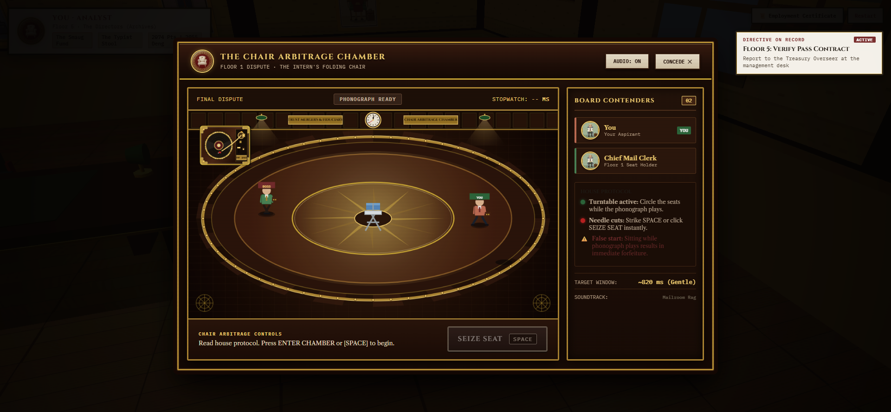

# The Supply Room (1987)

> **"Every applicant who enters these doors is sworn to a department fund. Choose your covenant carefully. You are now within The Mutual Fun. It operates with clockwork precision. Zero em dashes. Exact ledger entries."**

[](the_mutual_fun_trailer_30s.mp4)

---

## 🏛️ Executive Overview

**The Supply Room** is a 3D isometric corporate thriller and chair arbitrage odyssey built with Three.js and Web Audio API. Set in 1987 inside the towering high-rise headquarters of **The Mutual Fun**, players begin as an unadmitted applicant on the street pavement and must ascend ten grueling bureaucratic tiers to reach the Penthouse and confront the Sovereign Chairman.

Created by **[flickerrnft](https://x.com/themutualfun)**  
Story universe based on **The Mutual Fun**  
Official Trailer: [`the_mutual_fun_trailer_30s.mp4`](the_mutual_fun_trailer_30s.mp4)

---

## 🎬 Story & Lore: The Mutual Fun Universe

In 1987, finance isn't numbers on a screen; it is physical territory, leather upholstery, and institutional prestige. The headquarters of The Mutual Fun operates under ruthless bylaws of executive succession:

- **Contraband & Commodity Arbitrage**: Supplies, briefcases, and contraband trade hands through pneumatic chutes, back-office analyst desks, and secret syndicate lockboxes.
- **The Chair Dispute Protocol**: In the higher floors, promotions are not granted by human resources. When a department seat opens or is challenged, contenders enter **The Chair Arbitrage Chamber**. A high-fidelity spun-brass phonograph plays corporate waltzes while rivals promenade in an oval around the parquet floor.
- **The Needle Drop**: When the vinyl tonearm cuts and the executive brass desk bell tolls, contenders have mere milliseconds to strike their keys and seize the chair. The last one standing is expelled from the floor.

---

## 👥 Featured Characters & Lore

### 1. **flickerrnft (The Creator & Aspirant)**
- **Role**: Architect, Creator, and Protagonist.
- **Profile**: Creator of *The Supply Room* and chronicler of *The Mutual Fun* corporate mythology.
- **Journey**: Beginning outside the limestone gate with zero review points and a worn briefcase, flickerr navigates the labyrinthine corporate hierarchy, collecting department tokens, outmaneuvering institutional gatekeepers, and challenging each tier's reigning seat-holder.

### 2. **what3verman (Managing Director — Floor 6)**
- **Role**: Floor 6 Overseer, Managing Director.
- **Appearance**: Distinct green-and-yellow corporate frame, signature ruby cap, and wide-collar executive regalia.
- **Encounter**: Presides over the Floor 6 Executive Archives. Known for issuing unyielding directives, what3verman demands verified syndicate passes and rigorous contract validation before clearing aspirants to challenge the Green Banker's Chair.

### 3. **Kingpickle (The Chairman — Penthouse / Seat 0)**
- **Role**: Sovereign Trustee & Supreme Chairman of The Mutual Fun.
- **Appearance**: Bored Ape Captain regalia, gray fur, marine captain's cap with spun-gold insignia, and tie-dye corporate lapel accents.
- **Encounter**: Resides on Floor 9 inside the sun-drenched Gilded Penthouse. He occupies **Seat 0 & The Gilded Penthouse Throne**. The ultimate final arbiter of corporate power; defeating him in the final dispute grants complete lawful title and occupancy of the institution.

---

## 🏢 Corporate Floor Hierarchy

| Floor | Title / Role | Department | Seated Holder | Seat Title & Dispute Target Window |
| :--- | :--- | :--- | :--- | :--- |
| **0** | **Applicant** | The Pavement / Security | Security Gatekeeper | *The Pavement* (Admissions Gate) |
| **1** | **Intern** | Mailroom & Logistics | Chief Mail Clerk | *The Intern's Folding Chair* (~820 ms) |
| **2** | **Analyst** | Ledger & Reconciliations | Senior Analyst | *The Typist Stool* (~650 ms) |
| **3** | **Associate** | Desk Syndicate | Senior Associate | *Creaking Wooden Swivel* (~540 ms) |
| **4** | **Vice President** | Risk & Asset Arbitrage | Executive VP | *Beige Task Chair* (~480 ms) |
| **5** | **Director** | Archives & Fiduciary | Treasury Overseer | *High-Back Leather Desk Chair* (~420 ms) |
| **6** | **Managing Director** | Executive Operations | **what3verman** | *Green Banker's Chair* (~390 ms) |
| **7** | **Partner** | Partner Syndicate | Senior Equity Partner | *Oxblood Wingback Chair* (~360 ms) |
| **8** | **Board of Directors**| Board Conclave | Executive Governor | *Board of Directors High Seat* (~340 ms) |
| **9** | **The Chairman** | Sovereign Penthouse | **Kingpickle** | *The Gilded Penthouse Throne & Seat 0* (~330 ms) |

---

## 🎮 Gameplay Mechanics & Systems

### 1. **The 3D Isometric Headquarters Engine**
- Built in pure, dependency-free Three.js with custom procedural lighting, dynamic shadows, and vintage 1987 materials.
- Detailed architecture: mahogany wainscoting, brass dado rails, green-shaded banker's desk lamps, brass chandeliers, and corporate artwork.
- Interactive elevator concourse linking all unlocked corporate tiers.

### 2. **Tactile Musical Chairs Arena ("The Arbitrage Chamber")**
- **1987 Audiophile Turntable**: High-fidelity burl walnut plinth, spun-brass stroboscopic platter, high-gloss vinyl with specular sheen wedges, and physically animated gold S-curved tonearm.
- **Dynamic Tonearm Kinematics**: Tracks the vinyl microgrooves during the green promenade phase; violently scratches and lifts on red cut with an expanding visual shockwave.
- **Synthesized Audio Engine**: Real-time Web Audio API synthesizer generating dual-band vinyl noise sweeps and metallic dual-harmonic brass desk bell strikes (880 Hz + 1760 Hz).
- **Executive Tactile Deck**: Oxblood red sit control button with pulsating excitation (`.slam-ready`) upon music cut and keyboard input support (`[SPACE]`).

### 3. **The Official Certificate of Employment Registry**
- Real-time procedural canvas credential engine.
- Generates official high-resolution, vector-bordered 1987 employment certificates with custom seal stamps, employee registration numbers, and downloadable PNG exports.

---

## 🕹️ Controls

- **[W / A / S / D]** or **[Arrow Keys]**: Navigate through hallways, offices, and boardrooms.
- **[E]**: Interact with floor role holders, pneumatic chutes, elevator concourse, and desk terminals.
- **[SPACE]**: Advance dialogues, enter Arbitrage Chambers, and **SEIZE SEAT** when the needle scratches.
- **[ESC]**: Step back or exit modal registers.

---

## 🚀 Running Locally

Open `index.html` directly in any modern browser:

```bash
# Option 1: Direct browser launch
start index.html

# Option 2: Local HTTP server
npx serve .
# or
python -m http.server 8000
```

---

## 📜 Credits & Acknowledgments

- **Concept, Design & Direction**: [flickerrnft](https://x.com/themutualfun)
- **World & Lore**: The Mutual Fun Universe
- **Featured Personas**: what3verman & kingpickle
- **Media & Inquiries**: Follow [@themutualfun](https://x.com/themutualfun) on X
